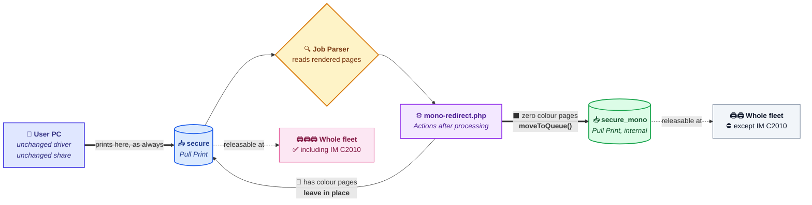
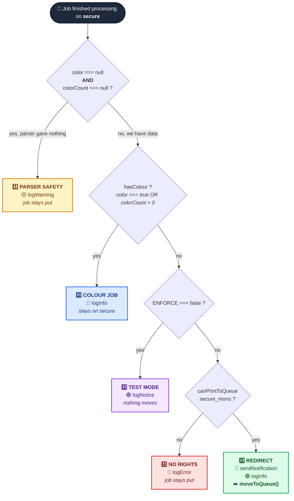
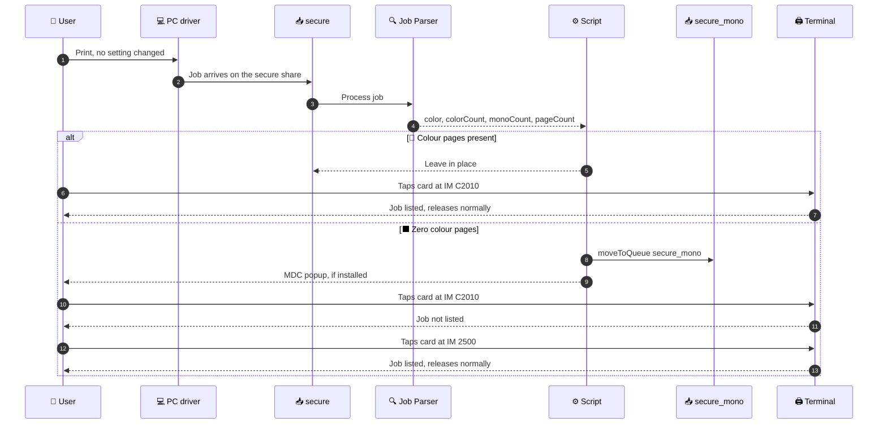
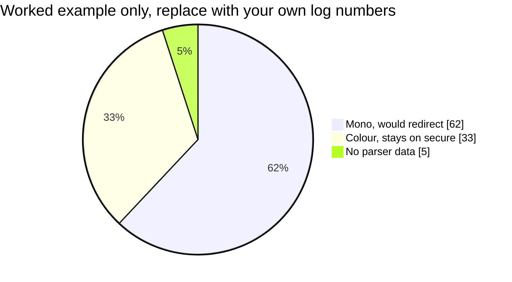

```mermaid
gantt
    title Deployment timeline
    dateFormat X
    axisFormat %s
    section 1️⃣ Server prep
    Licence, backup, unlock, parser      :p1, 0, 1
    section 2️⃣ Mono queue
    Clone secure, drop the C2010         :p2, after p1, 1
    section 3️⃣ Test mode
    Paste script, ENFORCE = false        :p3, after p2, 1
    section 4️⃣ Monitor
    3 to 5 working days of real traffic  :crit, p4, after p3, 5
    Present numbers, written approval    :milestone, m1, after p4, 0
    section 5️⃣ Enforce
    ENFORCE = true, nine tests           :p5, after p4, 1
    section 6️⃣ Close-out
    Re-lock scripting, handover          :p6, after p5, 1
```

<div align="center">

# 🖨️ MyQ Mono Job Redirect

### Keep black and white jobs off a colour printer, without touching a single PC

**A production MyQ X 10.2 job scripting solution that reserves a colour device for colour documents, moves mono jobs to a parallel queue instead of deleting them, and rolls back from one text field.**

<br/>

[](https://docs.myq-solution.com/en/myq-x/10.2/)
[](https://docs.myq-solution.com/en/myq-x/10.2/print-server/php-scripts-actions-examples)
[](#-the-hardware)
[](LICENSE)

[](#-why-this-design)
[](#-safety-model)
[](docs/09-rollback.md)
[](docs/09-rollback.md)
[](#-reference-deployment)

<br/>

[**⚡ Quick start**](#-quick-start) · [**📐 How it works**](#-how-it-works) · [**💻 The code**](src/) · [**📚 Runbook**](docs/) · [**🔧 Troubleshooting**](docs/11-troubleshooting.md) · [**📖 References**](docs/13-references.md)

</div>

---

## 🎯 The problem

A customer has a Ricoh IM C2010 that must be reserved for **colour documents only**. Staff keep sending plain black text to it, which burns colour consumables on work that any mono device could do.

The obvious fixes all fail on the same constraint:

| ❌ Approach | Why it fails here |
|---|---|
| Create a mono queue and point users at it | The customer has too many users to touch PCs. No GPO window, no time. |
| Remove the C2010 from the `secure` queue | Then it cannot print colour either, which defeats the point. |
| Device side function restrictions on the Ricoh | Blocks walk up copying too, and needs per user setup on the device. |
| Delete mono jobs sent to it | Users lose work. Non starter. |
| Force jobs to colour in script | MyQ's colour property is read-only in this context. |

**The constraint that shapes everything: nothing may change on a user PC.** Same share, same driver, same port.

---

## 💡 The solution

One fact makes this work: **a printer can belong to more than one MyQ queue.**

So you build a second Pull Print queue that is an exact clone of the live one, minus the colour device, and put a script on the live queue that moves any job with zero colour pages into it. The job is relocated, never copied, never deleted. The user collects it from any other printer and never knows the second queue exists.

<div align="center">



</div>

| Queue | Printers | Who prints to it |
|---|---|---|
| `secure` | **Unchanged.** Everything it has today, including the IM C2010 | Every user, exactly as before |
| `secure_mono` | **The same list, minus the IM C2010** | Nobody. The script is the only thing that puts jobs here. |

That single omitted printer is the entire mechanism. Everything else is mirroring.

---

## ⚡ Quick start

> ⚠️ Read the [full runbook](docs/) before a production deployment. This is the shape of the job, not a substitute for the procedure.

```
1️⃣  Easy Config → Security → enable "Unlock PHP Scripting" → restart services
2️⃣  Settings → Jobs → Job Parser → Standard (or Enhanced)
3️⃣  Queues → secure → record the Printers, Rights and Retention values
4️⃣  Queues → Add Queue → name "secure_mono", type Pull Print
        • same printers, MINUS the IM C2010
        • same rights, same retention
        • NO Windows share
5️⃣  Queues → secure → Job Processing → Scripting (PHP) → Actions after processing
        • paste src/mono-redirect.php with $ENFORCE = false
6️⃣  Print a black document → Log page → filter "MonoRedirect" → expect TEST MODE
7️⃣  Run 3 to 5 working days → present the numbers → get written approval
8️⃣  Set $ENFORCE = true → run the 9 test acceptance plan
9️⃣  Easy Config → Security → disable "Unlock PHP Scripting"
```

<div align="center">



</div>

---

## 📐 How it works

### The script logic

Five branches, evaluated top to bottom. Exactly one runs per job. The order is the safety design: parser failure is checked first so unknown content is never moved on a guess, and the rights check sits ahead of the move so a mismatch produces a log line instead of a stranded job.

<div align="center">



</div>

| Branch | Condition | Action | Job moves |
|:---:|---|---|:---:|
| 1️⃣ | Parser produced no colour data | `logWarning` | ❌ No |
| 2️⃣ | Colour pages present | `logInfo` | ❌ No |
| 3️⃣ | Mono, but `$ENFORCE = false` | `logNotice` | ❌ No |
| 4️⃣ | Mono, but user lacks rights on target | `logError` | ❌ No |
| 5️⃣ | Mono, enforcing, rights confirmed | notify + `moveToQueue` | ✅ **Yes** |

Four of the five branches deliberately do nothing. That ratio is the point.

### What the user sees

<div align="center">



</div>

The job is collectable in both paths. Nothing is ever lost, which is what makes the rollback story and the user communication story so short.

---

## 🛡️ Safety model

Five properties, each one load bearing.

| 🔒 Guarantee | How it is enforced |
|---|---|
| **No job is ever deleted** | `$this->delete()` is documented in MyQ and deliberately never used. Only `moveToQueue()`. |
| **No job is duplicated** | `moveToQueue()` relocates. It does not copy. |
| **Unknown content is never moved** | Branch 1 catches `null` parser data and leaves the job alone. |
| **Rights are checked before moving** | Branch 4 calls `canPrintToQueue()` first, so a mismatch logs instead of stranding. |
| **The live queue is never modified** | `secure` gets a script pasted into a text field. Its printers, rights and retention are untouched. |

### `$ENFORCE`, the whole reason this is safe to deploy

```php
$ENFORCE = false;   // logs what it WOULD do. Moves nothing.
$ENFORCE = true;    // actually moves jobs.
```

You run it against real production traffic for a week with `false`, collect the real percentage of affected jobs, show the customer that number, and only then flip it. The customer approves a figure, not a hypothesis.

---

## 📊 Reading the Phase 4 numbers

Every job lands in exactly one of three buckets. The split is the conversation you have with the customer before enforcing.

<div align="center">



</div>

> ⚠️ Those figures illustrate the format. They are not a prediction. Fill them from your own log before showing anyone.

| Bucket | Reading it |
|---|---|
| 🟢 **Mono, would redirect** | Expected to dominate in most offices. The higher it is, the more the customer needs to hear the number **before** enforcement, not after. |
| 🔵 **Colour, stays on `secure`** | No action. This is the traffic the C2010 exists for. |
| 🟡 **No parser data** | Above roughly 5 percent, move the Job Parser from Standard to Enhanced and rerun the window. Unparsed jobs never move, so a high figure means the rule is quietly doing nothing for part of the traffic. |

Full method in [Phase 4](docs/06-phase-4-monitor.md).

---

## 📦 Repository layout

Code and process are separated deliberately. The code is three short files. Everything else is procedure.

```
MyQ-Mono-Job-Redirect/
│
├── 💻 src/                                  CODE
│   ├── mono-redirect.php                    ⭐ the rule, paste into `secure`
│   ├── README.md                            API surface, config, control flow
│   └── optional/
│       ├── email-notification.php           email the user when a job moves
│       └── rename-job.php                   prefix the job name with [B&W]
│
├── 📚 docs/                                 PROCESS
│   ├── README.md                            runbook index and time budget
│   ├── 01-design.md                         objective, design, why no client work
│   ├── 02-pre-deployment-checklist.md       ten items, full deployment map
│   ├── 03-phase-1-server-preparation.md     licence, backup, unlock, parser
│   ├── 04-phase-2-mono-queue.md             clone the queue, drop the C2010
│   ├── 05-phase-3-test-mode.md              paste it, confirm it runs
│   ├── 06-phase-4-monitor.md                collect numbers, get approval
│   ├── 07-phase-5-enforce.md                switch on, nine test plan
│   ├── 08-phase-6-closeout.md               re-lock, record, handover
│   ├── 09-rollback.md                       four scenarios, zero downtime
│   ├── 10-limitations.md                    seven items, briefing sheet
│   ├── 11-troubleshooting.md                symptom to cause to fix
│   ├── 12-user-notice-template.md           optional announcement email
│   ├── 13-references.md                     every call mapped to MyQ docs
│   └── assets/                              deployment screenshots
│
├── README.md                                you are here
├── CHANGELOG.md
└── LICENSE                                  MIT
```

---

## 📸 Reference deployment

Captured from a live MyQ X 10.2 server.

<table>
<tr>
<td width="50%" valign="top">

**🔓 Easy Config, Unlock PHP Scripting**

The Scripting (PHP) field is read-only until this toggle is on. It exists because of CVE-2024-22076, so it goes back off in [Phase 6](docs/08-phase-6-closeout.md).


</td>
<td width="50%" valign="top">

**📥 Both queues, side by side**

`secure` carries the full fleet. `secure_mono` carries the same fleet without the colour device. Both Pull Print, both green.


</td>
</tr>
<tr>
<td colspan="2" valign="top">

**⚙️ The script in place, enforcing**

`secure` → Job Processing → Scripting (PHP) → Actions after processing, with `$ENFORCE = true`.


</td>
</tr>
</table>

---

## 🖧 The hardware

| Component | Role |
|---|---|
| **MyQ X Print Server 10.2** | Queues, job parsing, job scripting |
| **Ricoh IM C2010** | Colour device, the one being protected |
| **Ricoh IM 2500** | Mono device, where redirected jobs land |
| Existing fleet | Members of both queues, unchanged |
| **MyQ Desktop Client** | Optional. Popups only reach PCs running it. |

Nothing here is Ricoh specific. The design works on any fleet where one device needs reserving, and the script needs only the queue names changed.

---

## 📝 Log output

Every branch writes exactly one line, all tagged `[MonoRedirect]`. Filter the MyQ Log page on that tag and the whole rule is auditable.

| Level | Branch | Example |
|---|:---:|---|
| 🟡 `Warning` | 1️⃣ | `No colour data from parser. Job 'Report.pdf' (jsmith) left on 'secure'.` |
| 🔵 `Info` | 2️⃣ | `Colour job 'Brochure.pdf' (jsmith) colour=4 mono=2 - stays on 'secure'.` |
| 🟣 `Notice` | 3️⃣ | `TEST MODE - 'Minutes.docx' (jsmith, 3 pages) would move to 'secure_mono'.` |
| 🔴 `Error` | 4️⃣ | `'jsmith' has NO rights to 'secure_mono'. Job left on 'secure'.` |
| 🟢 `Info` | 5️⃣ | `Moving 'Minutes.docx' (jsmith, 3 pages) from 'secure' to 'secure_mono'.` |

---

## ⛔ Three rules that must not be broken

| Rule | Consequence if broken |
|---|---|
| **No `<?php` opening tag** | MyQ supplies the PHP context. An opening tag breaks the field. |
| **`moveToQueue()` stays the last statement** | The job is reprocessed under the target queue's rules from that call onward. Anything after it is unreliable. |
| **Never paste this on `secure_mono`** | The moved job is reprocessed by the target queue, so the same rule on both queues creates an infinite loop. |

---

## ⚠️ Known limitations

Seven items, all of which must be briefed to the customer before deployment. Full detail and a signable briefing sheet in [`docs/10-limitations.md`](docs/10-limitations.md).

| # | Limitation |
|---|---|
| 8.1 | 🎨 "B&W job" means **no colour content**, not "user selected B&W". A black document sent with Full Colour selected is still redirected. This is the source of almost every user question. |
| 8.2 | 👥 No per user exemption. Mono jobs are unavailable at the IM C2010 for everyone, management included. |
| 8.3 | 🔌 Printer power state is not checked before the move. Low risk here because the target queue holds the whole fleet minus one. |
| 8.4 | 🔔 Desktop popups need MyQ Desktop Client. Without it the move is silent, or use the optional email snippet. |
| 8.5 | 📇 Walk up mono **copying** on the IM C2010 is unaffected. That needs Ricoh side function restrictions. |
| 8.6 | 🚫 A job cannot be forced to colour. MyQ's colour property is read-only here. Redirecting is the correct design. |
| 8.7 | ♾️ Never place the script on the target queue. It loops. |

---

## ↩️ Rollback

| Scenario | Action | Downtime |
|---|---|:---:|
| 🔴 Rule behaving wrongly | Clear the Scripting (PHP) field on `secure`, Save | **None** |
| 🟡 Pause without losing config | Set `$ENFORCE = false`, Save | **None** |
| 🔵 Full revert | Clear the script, delete `secure_mono` | **None** |
| ⚫ Server level problem | Restore the Easy Config backup | Service restart |

`secure` is never modified during deployment, so there is nothing to restore on the queue every user depends on. Detail in [`docs/09-rollback.md`](docs/09-rollback.md).

---

## 📖 References

Every property and method used traces to official MyQ X 10.2 documentation.

- 📘 **[PHP Scripts Actions Examples](https://docs.myq-solution.com/en/myq-x/10.2/print-server/php-scripts-actions-examples)** — the canonical source. This project composes its colour property, `canPrintToQueue` rights check and conditional move patterns.
- 📘 [Job Scripting](https://docs.myq-solution.com/en/myq-x/10.2/print-server/job-scripting)
- 📘 [Job Processor Scripting](https://docs.myq-solution.com/en/myq-x/10.2/print-server/job-processor-scripting)
- 📘 [Job Scripting Reference](https://docs.myq-solution.com/en/myq-x/10.2/print-server/job-scripting-reference)
- 📘 [User Interaction Scripting](https://docs.myq-solution.com/en/myq-x/10.2/print-server/user-interaction-scripting)
- 🔐 **CVE-2024-22076** — the reason the Scripting (PHP) field is locked by default.

Call by call mapping in [`docs/13-references.md`](docs/13-references.md).

---

## 🔄 Adapting it elsewhere

| Requirement | Change |
|---|---|
| Different queue names | `$MONO_QUEUE`, and paste on your own source queue |
| Reverse it, keep colour off a mono device | Invert `$hasColour` in branch 2, point the target at a colour capable queue |
| Threshold instead of any colour at all | Replace `$colorPgs > 0` with your own limit, for example `$colorPgs > 2` |
| Restrict to one department | Wrap branch 5 in `$owner->hasGroup("...")` |
| Reserve by paper size or page count instead | Swap the colour test for `$this->paper` or `$this->pageCount` |

---

<div align="center">

### 📄 License

[MIT](LICENSE) · **Anik Sarker Akash**

Runbook prepared by SPSL Technical, Smart Printing Solutions Ltd.
Verified against MyQ X 10.2 Print Server documentation.

<br/>

**⭐ Star this repository if it saved you a GPO rollout.**

</div>
