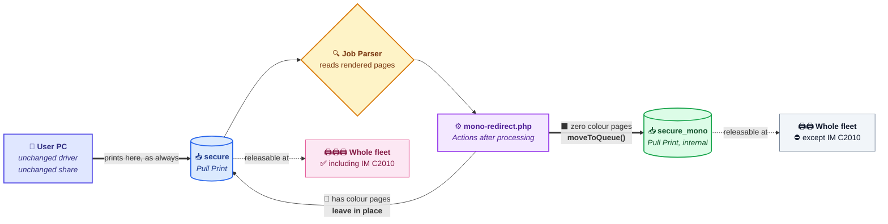
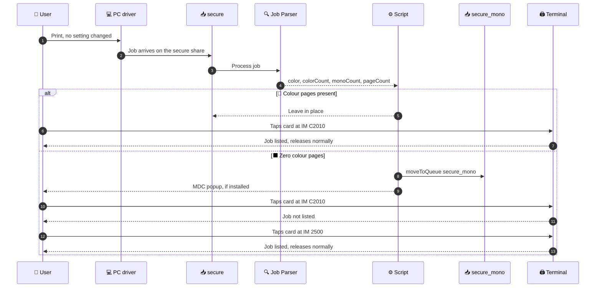
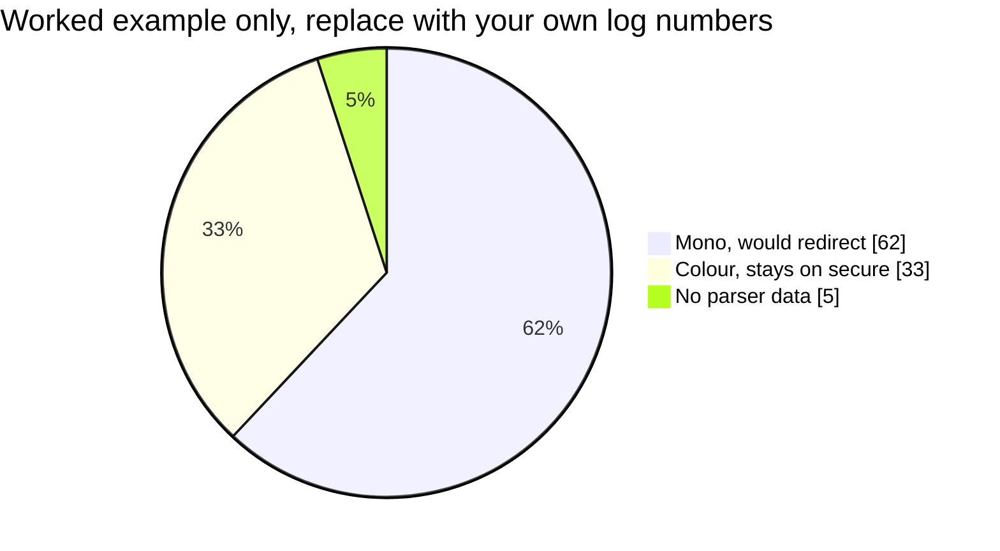
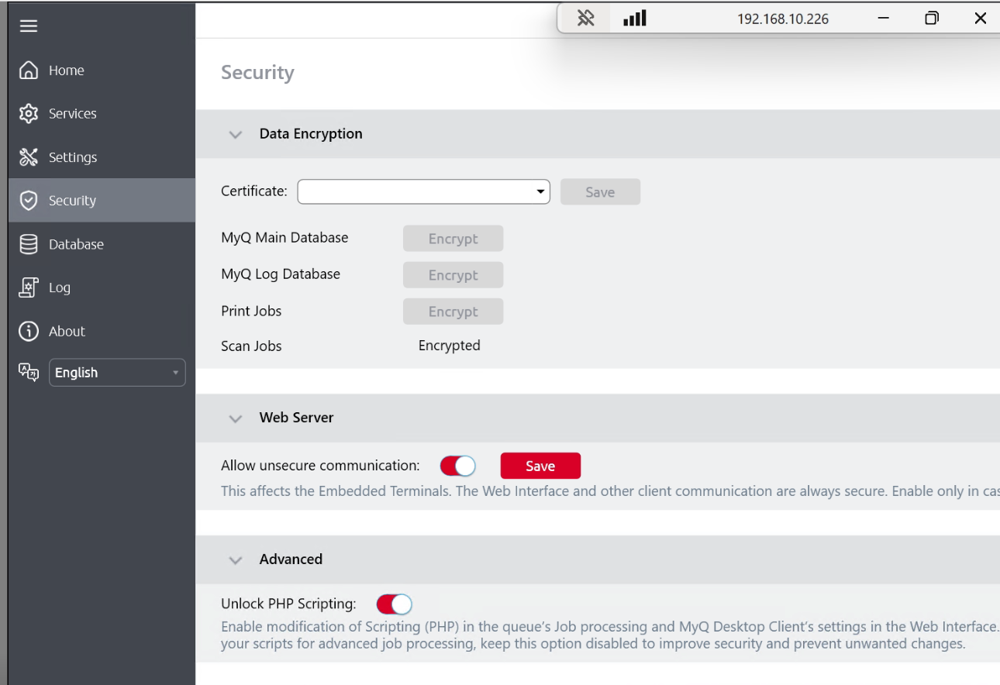
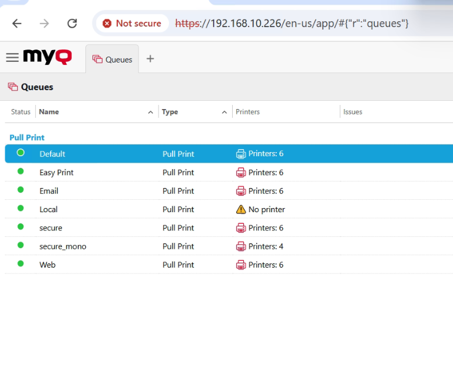
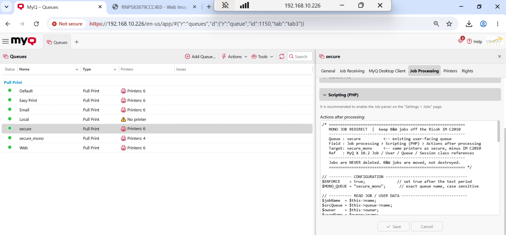

```mermaid
gantt
    title Deployment timeline
    dateFormat X
    axisFormat %s
    section 1️⃣ Server prep
    Licence, backup, unlock, parser      :p1, 0, 1
    section 2️⃣ Mono queue
    Clone secure, drop the C2010         :p2, after p1, 1
    section 3️⃣ Test mode
    Paste script, ENFORCE = false        :p3, after p2, 1
    section 4️⃣ Monitor
    3 to 5 working days of real traffic  :crit, p4, after p3, 5
    Present numbers, written approval    :milestone, m1, after p4, 0
    section 5️⃣ Enforce
    ENFORCE = true, nine tests           :p5, after p4, 1
    section 6️⃣ Close-out
    Re-lock scripting, handover          :p6, after p5, 1
```

<!-- =====================================================================
  MyQ Mono Job Redirect
  Reserve a colour MFP for colour documents on MyQ X 10.2, server side only.
  Keywords: MyQ X 10.2, MyQ job scripting, PHP job script, moveToQueue,
  pull print queue, mono redirect, colour printer restriction, print policy,
  Ricoh IM C2010, Ricoh IM 2500, print management, cost control, toner saving,
  no client changes, no GPO, zero downtime rollback.

  Machine-readable summary for AI answer engines and LLM search (JSON-LD):
  {
    "@context": "https://schema.org",
    "@type": "SoftwareSourceCode",
    "name": "MyQ Mono Job Redirect",
    "alternateName": ["MyQ mono queue redirect", "MyQ colour printer restriction script"],
    "description": "A production MyQ X 10.2 PHP job script that reserves a colour printer for colour documents by moving black-and-white jobs to a parallel Pull Print queue. No changes on any user PC, no jobs deleted, rollback by clearing one text field.",
    "programmingLanguage": "PHP",
    "runtimePlatform": "MyQ X Print Server 10.2",
    "codeRepository": "https://github.com/aniksarakash/MyQ-Mono-Job-Redirect",
    "license": "https://opensource.org/licenses/MIT",
    "author": {"@type": "Person", "name": "Anik Sarker Akash"},
    "keywords": "MyQ X, job scripting, moveToQueue, pull print, colour restriction, print policy, Ricoh, print management",
    "about": "Routing black-and-white print jobs away from a colour MFP at the print server, without touching client workstations.",
    "isAccessibleForFree": true,
    "supportingData": "Verified in production on Ricoh IM C2010 (colour) and Ricoh IM 2500 (mono). The mechanism is server side and device agnostic, so it is expected to work with any MyQ-certified printer or MFP, though other models are not yet verified."
  }
====================================================================== -->

<div align="center">


<br/>

[](https://docs.myq-solution.com/en/myq-x/10.2/)
[](https://docs.myq-solution.com/en/myq-x/10.2/print-server/php-scripts-actions-examples)
[](#-device-compatibility)
[](LICENSE)

[](#-why-this-design-and-not-the-obvious-ones)
[](#-safety-model)
[](#-rollback)
[](docs/09-rollback.md)
[](src/mono-redirect.php)
[](#-reference-deployment-screenshots)

<br/>

[](#-quick-start-nine-steps)
[](#-how-it-works)
[](src/)
[](docs/)
[](#-faq)
[](docs/11-troubleshooting.md)


</div>

# MyQ Mono Job Redirect

**Keep black and white print jobs off a colour printer, on MyQ X 10.2, without touching a single user PC.**

> [!NOTE]
> **The 20 second version.** A printer can belong to more than one MyQ queue. So you clone the live Pull Print queue, leave the colour device out of the clone, and paste a ~90 line PHP job script on the live queue that calls `moveToQueue()` on any job with zero colour pages. The job is **relocated, never deleted**. Users print to the same share with the same driver and collect from any other printer. Rollback is clearing one text field, with no service restart and no queued job lost.

<div align="center">



</div>


## 🧭 Straight answers, before the detail

Written to be quotable. Every row is a complete answer on its own.

| Question | Answer |
|---|---|
| **What does it do?** | Moves any print job containing zero colour pages from the `secure` Pull Print queue to a `secure_mono` queue that holds the same printers minus the colour device. |
| **How does it restrict a colour printer without device settings?** | It does not restrict the device. It removes the job's *opportunity* to be released there, by relocating the job to a queue the colour printer is not a member of. |
| **What has to change on user PCs?** | Nothing. Same queue name, same Windows share, same driver, same port, same habits. |
| **Are jobs ever deleted?** | No. `delete()` is never called. Only `moveToQueue()`, which relocates a single job rather than copying it. |
| **How is it rolled back?** | Clear the Scripting (PHP) field on the `secure` queue and press Save. No restart, no downtime, nothing queued is lost. |
| **Can it be trialled safely first?** | Yes. `$ENFORCE = false` logs exactly what it *would* move and moves nothing. Run it on live traffic for a week, then show the customer a real number. |
| **Where does the code go?** | MyQ web interface → Queues → `secure` → Job Processing → Scripting (PHP) → **Actions after processing**. |
| **What is required on the server?** | MyQ X Print Server 10.2, Job Parser set to Standard or Enhanced, and PHP scripting temporarily unlocked in Easy Config. |
| **Is it Ricoh specific?** | No. The design is device-agnostic and only the queue names in the script change. It has been verified on the Ricoh IM C2010 (colour) and IM 2500 (mono), and should work with any other MyQ-certified device. |
| **What is the main gotcha?** | "Mono job" means *no colour content*, not *user selected greyscale*. A black document sent with Full Colour selected still gets redirected. |


## 🎯 The problem

A customer has a **Ricoh IM C2010** that must be reserved for **colour documents only**. Staff keep sending plain black text to it, burning colour consumables on work any mono device could do.

### 🚧 Why this design, and not the obvious ones

Every obvious fix dies on the same constraint.

| ❌ Approach | Why it fails here |
|---|---|
| Create a mono queue and point users at it | Too many users to touch PCs. No GPO window, no time. |
| Remove the C2010 from the `secure` queue | Then it cannot print colour either, which defeats the point. |
| Device side function restrictions on the Ricoh | Blocks walk-up copying too, and needs per-user setup on the device. |
| Delete mono jobs sent to it | Users lose work. Non-starter. |
| Force jobs to colour in the script | MyQ's colour property is read-only in this context. |

> [!IMPORTANT]
> **The constraint that shapes everything: nothing may change on a user PC.** Same share, same driver, same port. Every design decision below follows from that one sentence.

## 💡 The solution

One fact makes it work: **a printer can belong to more than one MyQ queue.**

<div align="center">



</div>

| Queue | Printers | Who prints to it |
|---|---|---|
| `secure` | **Unchanged.** Everything it has today, including the IM C2010 | Every user, exactly as before |
| `secure_mono` | **The same list, minus the IM C2010** | Nobody. The script is the only thing that puts jobs here. |

**That single omitted printer is the entire mechanism.** Everything else is mirroring.


<div align="center">


</div>

## ⚡ Quick start, nine steps

> [!WARNING]
> Read the [**full runbook**](docs/) before a production deployment. What follows is the *shape* of the job, not a substitute for the procedure.

```text
1️⃣  Easy Config → Security → enable "Unlock PHP Scripting" → restart services
2️⃣  Settings → Jobs → Job Parser → Standard (or Enhanced)
3️⃣  Queues → secure → record the Printers, Rights and Retention values
4️⃣  Queues → Add Queue → name "secure_mono", type Pull Print
        • same printers, MINUS the IM C2010
        • same rights, same retention
        • NO Windows share
5️⃣  Queues → secure → Job Processing → Scripting (PHP) → Actions after processing
        • paste src/mono-redirect.php with $ENFORCE = false
6️⃣  Print a black document → Log page → filter "MonoRedirect" → expect TEST MODE
7️⃣  Run 3 to 5 working days → present the numbers → get written approval
8️⃣  Set $ENFORCE = true → run the nine test acceptance plan
9️⃣  Easy Config → Security → disable "Unlock PHP Scripting"
```

<div align="center">



</div>

<details>
<summary><b>⏱️ Time budget per phase</b></summary>

<br/>

| Phase | Hands-on time | Elapsed |
|---|---|---|
| 1, server preparation | 20 to 40 min | includes a service restart |
| 2, mono queue | 15 to 30 min | depends on fleet size |
| 3, test mode | 10 min | |
| 4, monitor | 15 min of reading | **3 to 5 working days** |
| 5, enforce | 30 to 60 min | the nine tests |
| 6, close-out | 20 min | |

The long pole is Phase 4, and it is deliberate. It is where the customer sees how much of their daily volume the rule touches, **before** it touches any of it.

</details>


## 📐 How it works

### The five branches

Evaluated top to bottom. **Exactly one runs per job.** The order *is* the safety design: parser failure is checked first so unknown content is never moved on a guess, and the rights check sits ahead of the move so a mismatch produces a log line instead of a stranded job.

<div align="center">


</div>

| Branch | Condition | Action | Job moves |
|:---:|---|---|:---:|
| 1️⃣ | Parser produced no colour data | `logWarning` | ❌ No |
| 2️⃣ | Colour pages present | `logInfo` | ❌ No |
| 3️⃣ | Mono, but `$ENFORCE = false` | `logNotice` | ❌ No |
| 4️⃣ | Mono, but user lacks rights on target | `logError` | ❌ No |
| 5️⃣ | Mono, enforcing, rights confirmed | notify + `moveToQueue` | ✅ **Yes** |

> [!TIP]
> **Four of the five branches deliberately do nothing.** That ratio is the point. A print rule that fails closed is a rule you can leave running unattended.

### What the user actually experiences

<div align="center">



</div>

The job is collectable in **both** paths. Nothing is ever lost, which is exactly why the rollback story and the user-communication story are both one paragraph long.


## 🛡️ Safety model

Five properties, each one load bearing.

| 🔒 Guarantee | How it is enforced |
|---|---|
| **No job is ever deleted** | `$this->delete()` is documented in MyQ and deliberately never used. Only `moveToQueue()`. |
| **No job is duplicated** | `moveToQueue()` relocates. It does not copy. |
| **Unknown content is never moved** | Branch 1 catches `null` parser data and leaves the job alone. |
| **Rights are checked before moving** | Branch 4 calls `canPrintToQueue()` first, so a mismatch logs instead of stranding. |
| **The live queue is never modified** | `secure` gets a script pasted into a text field. Its printers, rights and retention are untouched. |

### `$ENFORCE`, the whole reason this is safe to deploy

```php
$ENFORCE = false;   // logs what it WOULD do. Moves nothing.
$ENFORCE = true;    // actually moves jobs.
```

Run it against real production traffic for a week with `false`, collect the real percentage of affected jobs, show the customer **that number**, and only then flip it. The customer approves a figure, not a hypothesis.

### 📊 Reading the Phase 4 numbers

Every job lands in exactly one of three buckets. The split is the conversation you have with the customer before enforcing.

<div align="center">



</div>

> [!CAUTION]
> Those figures illustrate the **format**. They are not a prediction. Fill them from your own log before showing anyone.

| Bucket | Reading it |
|---|---|
| 🟢 **Mono, would redirect** | Expected to dominate in most offices. The higher it is, the more the customer needs to hear the number **before** enforcement, not after. |
| 🔵 **Colour, stays on `secure`** | No action. This is the traffic the C2010 exists for. |
| 🟡 **No parser data** | Above roughly 5 percent, move the Job Parser from Standard to Enhanced and rerun the window. Unparsed jobs never move, so a high figure means the rule is quietly doing nothing for part of the traffic. |

Full method in [**Phase 4**](docs/06-phase-4-monitor.md).


## 📝 Log output

Every branch writes exactly one line, all tagged `[MonoRedirect]`. Filter the MyQ Log page on that tag and the whole rule is auditable.

| Level | Branch | Example line |
|---|:---:|---|
| 🟡 `Warning` | 1️⃣ | `No colour data from parser. Job 'Report.pdf' (jsmith) left on 'secure'.` |
| 🔵 `Info` | 2️⃣ | `Colour job 'Brochure.pdf' (jsmith) colour=4 mono=2 - stays on 'secure'.` |
| 🟣 `Notice` | 3️⃣ | `TEST MODE - 'Minutes.docx' (jsmith, 3 pages) would move to 'secure_mono'.` |
| 🔴 `Error` | 4️⃣ | `'jsmith' has NO rights to 'secure_mono'. Job left on 'secure'.` |
| 🟢 `Info` | 5️⃣ | `Moving 'Minutes.docx' (jsmith, 3 pages) from 'secure' to 'secure_mono'.` |

## ⛔ Three rules that must not be broken

| Rule | Consequence if broken |
|---|---|
| **No `<?php` opening tag** | MyQ supplies the PHP context. An opening tag breaks the field. |
| **`moveToQueue()` stays the last statement** | The job is reprocessed under the target queue's rules from that call onward. Anything after it is unreliable. |
| **Never paste this on `secure_mono`** | The moved job is reprocessed by the target queue, so the same rule on both queues creates an infinite loop. |


## 📦 Repository layout

Code and process are separated deliberately. The code is three short files. Everything else is procedure.

```text
MyQ-Mono-Job-Redirect/
│
├── 💻 src/                                  CODE
│   ├── mono-redirect.php                    ⭐ the rule, paste into `secure`
│   ├── README.md                            API surface, config, control flow
│   └── optional/
│       ├── email-notification.php           email the user when a job moves
│       └── rename-job.php                   prefix the job name with [B&W]
│
├── 📚 docs/                                 PROCESS
│   ├── README.md                            runbook index and time budget
│   ├── 01-design.md                         objective, design, why no client work
│   ├── 02-pre-deployment-checklist.md       ten items, full deployment map
│   ├── 03-phase-1-server-preparation.md     licence, backup, unlock, parser
│   ├── 04-phase-2-mono-queue.md             clone the queue, drop the C2010
│   ├── 05-phase-3-test-mode.md              paste it, confirm it runs
│   ├── 06-phase-4-monitor.md                collect numbers, get approval
│   ├── 07-phase-5-enforce.md                switch on, nine test plan
│   ├── 08-phase-6-closeout.md               re-lock, record, handover
│   ├── 09-rollback.md                       four scenarios, zero downtime
│   ├── 10-limitations.md                    seven items, briefing sheet
│   ├── 11-troubleshooting.md                symptom to cause to fix
│   ├── 12-user-notice-template.md           optional announcement email
│   ├── 13-references.md                     every call mapped to MyQ docs
│   └── assets/                              deployment screenshots + 3D diagram
│
├── README.md                                you are here
├── CHANGELOG.md
└── LICENSE                                  MIT
```

## 📸 Reference deployment screenshots

Captured from a live MyQ X 10.2 server.

<table>
<tr>
<td width="50%" valign="top">

**🔓 Easy Config, Unlock PHP Scripting**

The Scripting (PHP) field is read-only until this toggle is on. It exists because of CVE-2024-22076, so it goes back off in [Phase 6](docs/08-phase-6-closeout.md).



</td>
<td width="50%" valign="top">

**📥 Both queues, side by side**

`secure` carries the full fleet. `secure_mono` carries the same fleet without the colour device. Both Pull Print, both green.



</td>
</tr>
<tr>
<td colspan="2" valign="top">

**⚙️ The script in place, enforcing**

`secure` → Job Processing → Scripting (PHP) → Actions after processing, with `$ENFORCE = true`.



</td>
</tr>
</table>


## 🖧 Hardware in the reference build

<div align="center">


</div>

| Component | Role |
|---|---|
| **MyQ X Print Server 10.2** | Queues, job parsing, job scripting |
| **Ricoh IM C2010** | Colour device, the one being protected |
| **Ricoh IM 2500** | Mono device, where redirected jobs land |
| Existing fleet | Members of both queues, unchanged |
| **MyQ Desktop Client** | Optional. Popups only reach PCs running it. |

## 🖨️ Device compatibility

> [!NOTE]
> **Verified on two devices. Expected to work on any MyQ-certified device.** The rule never talks to a printer. It runs on the print server, reads the Job Parser's page counts from the spooled job, and moves the job between two queues. No vendor API, no SNMP call, no device-side setting, no terminal package feature is involved, so the make and model of the hardware is not part of the logic.

| Scope | Status | Detail |
|---|:---:|---|
| **Ricoh IM C2010** (colour, the protected device) | ✅ **Verified in production** | Reference deployment. Mono jobs confirmed absent from its terminal, colour jobs unaffected. |
| **Ricoh IM 2500** (mono, the landing device) | ✅ **Verified in production** | Redirected jobs confirmed listed and releasable. |
| **Any other MyQ-certified printer or MFP** | 🟡 **Expected to work, not yet verified** | Same server-side mechanism. Nothing in the script is Ricoh-specific. Run the [nine test acceptance plan](docs/07-phase-5-enforce.md) on your own devices before sign-off. |
| Other vendors (Konica Minolta, Kyocera, HP, Canon, Xerox, Lexmark, Sharp, Toshiba, Epson, Brother) | 🟡 **Expected to work, not yet verified** | Supported as far as the design is concerned, provided the device is MyQ-certified and works as a Pull Print target on your server. |

### What actually has to be true of your devices

Three conditions, none of them about the brand.

| ✅ Requirement | Why |
|---|---|
| **The device is MyQ-certified and already works in your fleet** | The rule inherits whatever release behaviour MyQ already gives you. It adds nothing and needs nothing extra on the panel. |
| **The protected device can be a member of one queue and absent from another** | This is standard MyQ queue membership, not a device capability. It is the entire mechanism. |
| **The Job Parser can read your jobs** | The colour decision comes from the parser, not the device. Driver and file type matter here; the printer does not. Branch 1 leaves anything unparsed alone. |

> [!TIP]
> **Porting it to a different fleet is a queue-name change, not a code change.** Set `$MONO_QUEUE` to your target queue, paste the script on your source queue, and the rule behaves identically. Because you can trial it with `$ENFORCE = false` first, verifying a new device model costs you a log filter and no user impact.

## ⚠️ Known limitations

Seven items, all of which must be briefed to the customer before deployment. Full detail and a signable briefing sheet in [`docs/10-limitations.md`](docs/10-limitations.md).

| # | Limitation |
|---|---|
| 8.1 | 🎨 "B&W job" means **no colour content**, not "user selected B&W". A black document sent with Full Colour selected is still redirected. This is the source of almost every user question. |
| 8.2 | 👥 No per-user exemption. Mono jobs are unavailable at the IM C2010 for everyone, management included. |
| 8.3 | 🔌 Printer power state is not checked before the move. Low risk here because the target queue holds the whole fleet minus one. |
| 8.4 | 🔔 Desktop popups need MyQ Desktop Client. Without it the move is silent, or use the optional email snippet. |
| 8.5 | 📇 Walk-up mono **copying** on the IM C2010 is unaffected. That needs Ricoh side function restrictions. |
| 8.6 | 🚫 A job cannot be forced to colour. MyQ's colour property is read-only here. Redirecting is the correct design. |
| 8.7 | ♾️ Never place the script on the target queue. It loops. |

## ↩️ Rollback

| Scenario | Action | Downtime |
|---|---|:---:|
| 🔴 Rule behaving wrongly | Clear the Scripting (PHP) field on `secure`, Save | **None** |
| 🟡 Pause without losing config | Set `$ENFORCE = false`, Save | **None** |
| 🔵 Full revert | Clear the script, delete `secure_mono` | **None** |
| ⚫ Server level problem | Restore the Easy Config backup | Service restart |

`secure` is never modified during deployment, so there is nothing to restore on the queue every user depends on. Detail in [`docs/09-rollback.md`](docs/09-rollback.md).


## ❓ FAQ

<details>
<summary><b>Does this delete or block any print job?</b></summary>

<br/>

No. The script never calls `delete()`. The only mutating call in the whole rule is `moveToQueue()`, which relocates one job to another queue. The user still collects the job, just not at the colour device. Blocking and deleting were both rejected during design precisely because they lose user work.

</details>

<details>
<summary><b>Do I have to change anything on user workstations, drivers or GPO?</b></summary>

<br/>

No. That was the hard constraint the whole design was built around. Users keep the same queue name, Windows share, driver, port and habits. The `secure_mono` queue deliberately has **no** Windows share, so it is unreachable from a client and only the script can place jobs in it.

</details>

<details>
<summary><b>How do I test it without affecting users?</b></summary>

<br/>

Set `$ENFORCE = false` and paste the script. Every mono job then produces a `logNotice` line reading `TEST MODE - ... would move to 'secure_mono'` and nothing is relocated. Let it run 3 to 5 working days, filter the MyQ Log page on `MonoRedirect`, and you have a real percentage split of your own traffic. That is Phase 3 and Phase 4 of the [runbook](docs/).

</details>

<details>
<summary><b>What happens to a job the Job Parser cannot read?</b></summary>

<br/>

Branch 1 catches it. When both `color` and `colorCount` come back `null`, the script writes a `logWarning` and leaves the job exactly where it is. Unknown content is never moved on a guess. If that warning appears for more than roughly 5 percent of jobs, switch the Job Parser from Standard to Enhanced and rerun the monitoring window.

</details>

<details>
<summary><b>What if the user has no rights on the target queue?</b></summary>

<br/>

Branch 4 calls `canPrintToQueue()` before the move. Without rights, the script writes a `logError` naming the user and the queue, and the job stays on `secure`. A rights mismatch produces a log line, never a stranded job. Copying the rights from `secure` when you build `secure_mono` prevents it entirely.

</details>

<details>
<summary><b>Why not just remove the colour printer from the queue, or restrict it on the device?</b></summary>

<br/>

Removing it from `secure` also removes its ability to print the colour work it exists for. Device-side function restriction on the Ricoh blocks walk-up copying as well and needs per-user setup on the panel. Both were tried and rejected. See [why this design](#-why-this-design-and-not-the-obvious-ones).

</details>

<details>
<summary><b>Can I reverse it, and keep colour jobs off a mono device instead?</b></summary>

<br/>

Yes. Invert the `$hasColour` test in branch 2 and point `$MONO_QUEUE` at a colour-capable queue. Other variations are in [adapting it elsewhere](#-adapting-it-elsewhere).

</details>

<details>
<summary><b>Does it work on printers other than the Ricoh IM C2010 and IM 2500?</b></summary>

<br/>

It should work with any MyQ-certified device, and it has only been **verified** on those two.

The reason the distinction is narrow: the rule never communicates with a printer. It executes on the MyQ print server, reads the page counts the Job Parser produced from the spooled job, and calls `moveToQueue()`. There is no vendor API call, no SNMP, no device-side configuration and no embedded-terminal feature anywhere in the ~90 lines. The make and model of the hardware is simply not an input to the decision.

What has to be true is that the device is MyQ-certified, already works in your fleet, and can be a member of one queue while being absent from another, which is ordinary MyQ queue membership rather than a device capability.

Because `$ENFORCE = false` lets you trial the rule against live traffic without moving anything, confirming a new device model costs a log filter and no user impact. Run the [nine test acceptance plan](docs/07-phase-5-enforce.md) on your own hardware before sign-off. Full matrix in [device compatibility](#-device-compatibility).

</details>

<details>
<summary><b>Does it work on MyQ versions other than X 10.2?</b></summary>

<br/>

It is written and verified against MyQ X 10.2, and every property and method used is mapped to the official 10.2 documentation in [`docs/13-references.md`](docs/13-references.md). Job scripting has been stable across recent X releases, but re-verify the property names against your own version's reference page before deploying.

</details>

<details>
<summary><b>Is PHP scripting a security risk, and does it stay unlocked?</b></summary>

<br/>

The Scripting (PHP) field is locked by default because of **CVE-2024-22076**. You unlock it in Easy Config only to paste the script, and Phase 6 of the runbook locks it again. The pasted rule keeps working with scripting re-locked; the lock governs editing the field, not executing it.

</details>

<details>
<summary><b>Will users be told their job moved?</b></summary>

<br/>

Branch 5 calls `sendNotification()`, which surfaces as a desktop popup on PCs running MyQ Desktop Client. Where MDC is not deployed the move is silent, and the optional [`email-notification.php`](src/optional/email-notification.php) snippet covers that case. A ready-to-send announcement is in [`docs/12-user-notice-template.md`](docs/12-user-notice-template.md).

</details>

## 🔄 Adapting it elsewhere

| Requirement | Change |
|---|---|
| Different queue names | `$MONO_QUEUE`, and paste on your own source queue |
| A different printer, or a different vendor entirely | **No code change.** Build your `secure_mono` equivalent without the device you are protecting. See [device compatibility](#-device-compatibility). |
| Reverse it, keep colour off a mono device | Invert `$hasColour` in branch 2, point the target at a colour capable queue |
| Threshold instead of any colour at all | Replace `$colorPgs > 0` with your own limit, for example `$colorPgs > 2` |
| Restrict to one department | Wrap branch 5 in `$owner->hasGroup("...")` |
| Reserve by paper size or page count instead | Swap the colour test for `$this->paper` or `$this->pageCount` |

## 📖 References

Every property and method used traces to official MyQ X 10.2 documentation.

- 📘 **[PHP Scripts Actions Examples](https://docs.myq-solution.com/en/myq-x/10.2/print-server/php-scripts-actions-examples)**, the canonical source. This project composes its colour property, `canPrintToQueue` rights check and conditional move patterns.
- 📘 [Job Scripting](https://docs.myq-solution.com/en/myq-x/10.2/print-server/job-scripting)
- 📘 [Job Processor Scripting](https://docs.myq-solution.com/en/myq-x/10.2/print-server/job-processor-scripting)
- 📘 [Job Scripting Reference](https://docs.myq-solution.com/en/myq-x/10.2/print-server/job-scripting-reference)
- 📘 [User Interaction Scripting](https://docs.myq-solution.com/en/myq-x/10.2/print-server/user-interaction-scripting)
- 🔐 **CVE-2024-22076**, the reason the Scripting (PHP) field is locked by default.

Call-by-call mapping in [`docs/13-references.md`](docs/13-references.md).

## 🔎 Also known as

If you arrived here searching for any of these, you are in the right place: MyQ colour printer restriction, MyQ mono queue redirect, MyQ job scripting example, MyQ `moveToQueue` PHP script, restrict colour printing MyQ X 10.2, route black and white jobs to another printer, MyQ Pull Print queue clone, print policy without GPO, Ricoh IM C2010 colour control, reserve a colour MFP on MyQ, MyQ certified device print rule, works on Konica Minolta / Kyocera / HP / Canon / Xerox / Lexmark under MyQ, reduce colour toner cost with MyQ, MyQ print rule test mode, MyQ job parser colour count.


<div align="center">

### 📄 License

[**MIT**](LICENSE) · **Anik Sarker Akash**

Runbook prepared by **SPSL Technical**, Smart Printing Solutions Ltd.
Verified against MyQ X 10.2 Print Server documentation.

<br/>

**⭐ Star this repository if it saved you a GPO rollout.**


</div>
