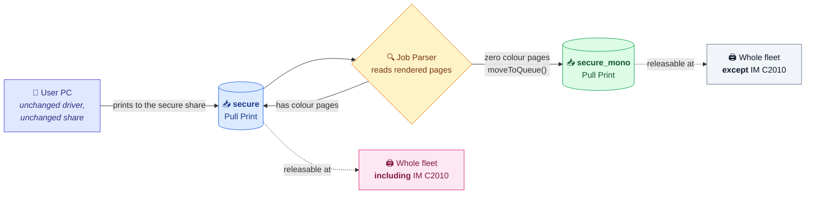
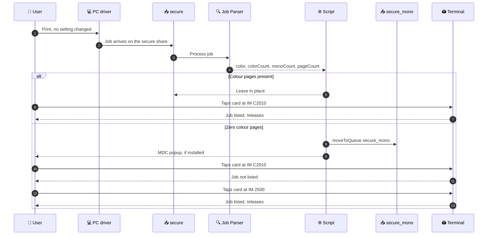

# 📐 Objective and Design

## 1. Objective

The Ricoh IM C2010 must be reserved for colour documents. Any job with no colour pages must not be releasable on that device, and must not be deleted. The user collects it from any other printer instead.

**Constraint:** the customer has too many users to touch PCs. Everything must be done inside MyQ.

---

## 2. Design

Users already print to a single Pull Print queue called `secure`. A printer can belong to more than one MyQ queue. That single fact is what makes this possible without touching a PC.

| Queue | Printers | Role |
|---|---|---|
| `secure` | **Unchanged.** Everything it contains today, including the IM C2010 | Users keep printing here |
| `secure_mono` | **The same list, minus the IM C2010** | Internal landing queue, never printed to directly |

A script on `secure` moves any job with no colour pages into `secure_mono`.

### Why this design

| ✅ | Property | Detail |
|:---:|---|---|
| 🚫 | **Zero client side work** | Same share, same port, same driver. No GPO, no MDC provisioning. |
| 🔒 | **`secure` is never modified** | You add a queue and paste a script into a text field. That is all. |
| 📄 | **No duplicate jobs** | `moveToQueue` relocates the job, it does not copy it. |
| 🌐 | **No fleet wide disruption** | The only behaviour change anywhere is that mono jobs stop appearing at the IM C2010. |
| ↩️ | **Rollback is one text field** | Clear the script and save. |

Users never see `secure_mono`. A pull print queue surfaces at a terminal based on printer membership, not on anything installed on the PC.

---

## 3. What the user experiences

The job is never lost in either path. That is the point of the design, and it is what makes rollback and user communication simple.

---

## 4. Note on drivers

The `secure` queue already releases jobs across multiple printer models today, so cross model PDL handling is already proven in this environment. No driver change is needed.

---

*Next: [Pre-deployment checklist](02-pre-deployment-checklist.md)*
