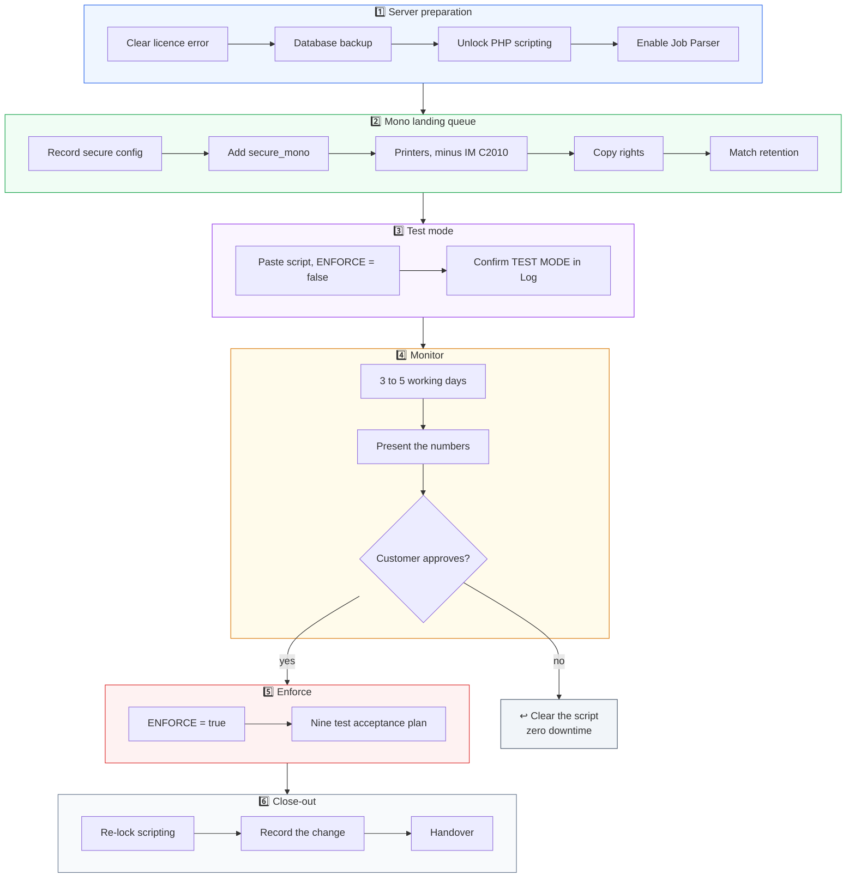

# ☑️ Pre-deployment Checklist

Confirm all ten before touching anything. Items 3 to 5 are the ones engineers skip and then regret, because they are the values you need to mirror onto the new queue.

| # | Item | Done |
|---|---|:---:|
| 1 | MyQ licence valid, server running, no red banner | ☐ |
| 2 | Full database backup taken via Easy Config | ☐ |
| 3 | Exact printer list of `secure` recorded | ☐ |
| 4 | Rights list of `secure` recorded | ☐ |
| 5 | Job retention setting of `secure` recorded | ☐ |
| 6 | Ricoh IM 2500 online in MyQ | ☐ |
| 7 | Ricoh IM C2010 online in MyQ | ☐ |
| 8 | Confirmed whether MyQ Desktop Client is deployed | ☐ |
| 9 | Customer briefed on the content based limitation | ☐ |
| 10 | Change window agreed in writing | ☐ |

Item 9 points at [limitation 8.1](10-limitations.md). Brief it before deployment, not after the first user complaint.

---

## 🗺️ Full deployment map

---

*Next: [Phase 1, server preparation](03-phase-1-server-preparation.md)*
