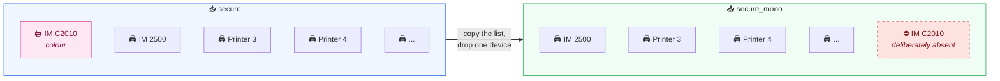

# 2️⃣ Phase 2, Create the Mono Landing Queue

Six steps. Step 2.3 is the actual mechanism. The rest is mirroring.

---

## Step 2.1 📋 Record the current configuration

**Queues → secure.** Screenshot and write down:

| Tab | What to capture |
|---|---|
| **Printers** | The full printer list |
| **Rights** | The full user and group list |
| **General** | The job retention and expiry setting |

> ⚠️ Change nothing on this queue yet.

These three values are what you mirror in steps 2.3 to 2.5. Getting them wrong is the single largest source of post-deployment tickets.

---

## Step 2.2 ➕ Add the queue

**Queues → Add Queue**

| Setting | Value |
|---|---|
| Name | `secure_mono` (exact, case sensitive) |
| Type | Pull Print |

The name must match `$MONO_QUEUE` in the script character for character.

---

## Step 2.3 🖨️ Printers

Add **the same printer list you recorded in Step 2.1, omitting the Ricoh IM C2010.**

That omission is the entire mechanism. Everything else about the queue mirrors `secure`.

---

## Step 2.4 👥 Rights

Copy the rights from `secure` exactly.

`moveToQueue` fails if the user has no rights to the target, so any mismatch leaves jobs stranded on the colour queue. Branch 4 of the script catches this and logs it rather than losing the job, but the job still will not be where the user expects.

---

## Step 2.5 ⏳ Retention

Match the job expiry to `secure`.

If the mono queue expires faster and a user does not collect promptly, they will report that the job vanished. There is no way to tell from the terminal that a job expired rather than disappeared.

---

## Step 2.6 🚫 Do not add a Windows share

`secure_mono` is internal. No share, no LPR port, no driver, no GPO. Users never send jobs to it directly.

If you add a share, someone will eventually print to it, and jobs sent there bypass the rule entirely.

---

## ✅ Phase 2 exit criteria

| Check | State |
|---|:---:|
| `secure_mono` exists, type Pull Print | ☐ |
| Printer list mirrors `secure` minus IM C2010 | ☐ |
| IM C2010 confirmed **absent** from `secure_mono` | ☐ |
| Rights identical to `secure` | ☐ |
| Retention identical to `secure` | ☐ |
| No Windows share on `secure_mono` | ☐ |
| `secure` still unmodified | ☐ |

---

*Next: [Phase 3, deploy in test mode](05-phase-3-test-mode.md)*
