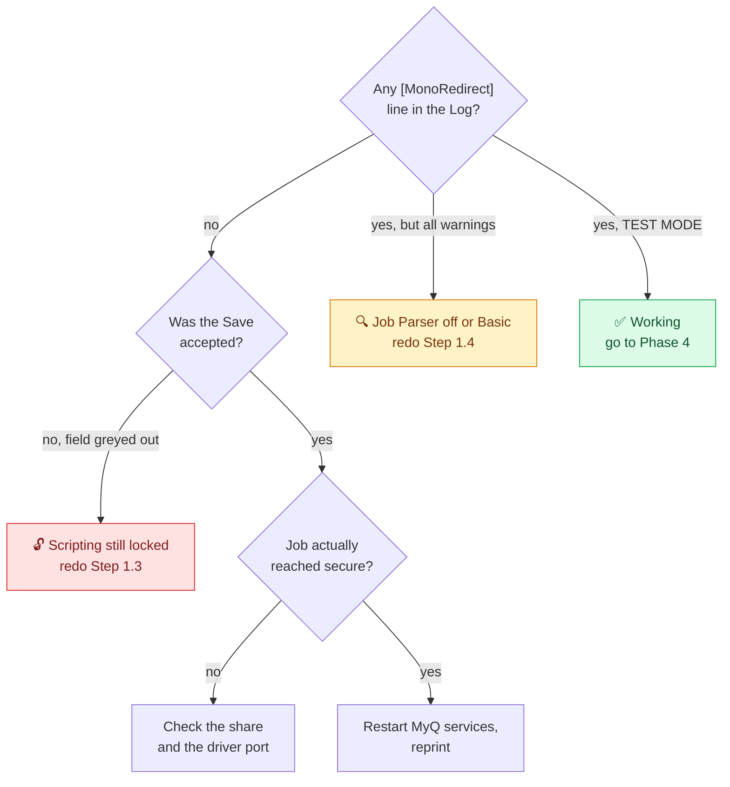

# 3️⃣ Phase 3, Deploy the Script in Test Mode

Test mode reads real traffic and writes real log lines, but moves nothing. It is safe to leave running indefinitely.

---

## Step 3.1 📋 Paste it

**Queues → secure → Job Processing tab → Scripting (PHP) → Actions after processing**

Paste [`../src/mono-redirect.php`](../src/mono-redirect.php) with `$ENFORCE = false`. Click **Save**.


| ⚠️ | Rule |
|:---:|---|
| 1 | Do **not** include a `<?php` opening tag. MyQ supplies the context. |
| 2 | Paste into **Actions after processing**, not "Actions before processing". The parser data does not exist yet before processing. |
| 3 | `$ENFORCE` must read `false` on this pass. |
| 4 | Never paste this into `secure_mono`. See [limitation 8.7](10-limitations.md). |

---

## Step 3.2 🔍 Confirm it runs

Print one plain black text document. Go to the **Log** page and filter for `MonoRedirect`.

A `TEST MODE` line should appear:

```
[MonoRedirect] TEST MODE - 'Document1.docx' (jsmith, 1 pages) would move to 'secure_mono'.
```

### If nothing appears at all

The script is not executing. Work through this in order:



A log full of `No colour data from parser` warnings means the script runs fine but the Job Parser is off or set to Basic. Fix [Step 1.4](03-phase-1-server-preparation.md) before starting the monitoring window, otherwise your Phase 4 numbers are worthless.

---

## ✅ Phase 3 exit criteria

| Check | State |
|---|:---:|
| Script saved on `secure`, `$ENFORCE = false` | ☐ |
| `TEST MODE` line confirmed in the Log | ☐ |
| Colour test job produces a `Colour job` line | ☐ |
| No `No colour data` warnings on normal documents | ☐ |

---

*Next: [Phase 4, monitor and sign off](06-phase-4-monitor.md)*
