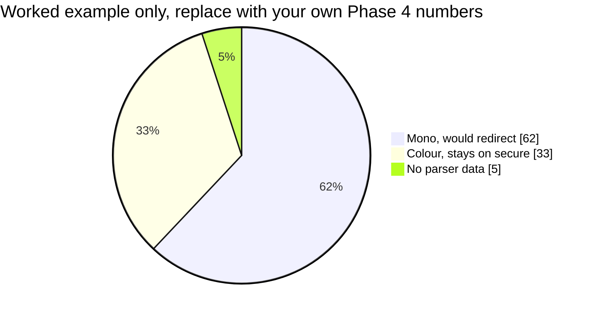

# 4️⃣ Phase 4, Monitor and Sign Off

This is the decision point of the whole deployment. Enforcement is a business decision, and this phase produces the number the business decides on.

---

## Step 4.1 📊 Run 3 to 5 working days

Filter the Log for `[MonoRedirect]` and record:

| Metric | Where it comes from | Value |
|---|---|---|
| Total jobs through `secure` | all `[MonoRedirect]` lines | |
| Jobs that would be redirected | `TEST MODE` lines | |
| Percentage redirected | calculated | |
| Users most affected | usernames in `TEST MODE` lines | |
| Jobs with no parser data | `No colour data` warnings | |

Three days is the minimum. Five is better, because print volume is rarely flat across a week and Monday looks nothing like Friday in most offices.

### Reading the mix

Every job lands in exactly one bucket. The shape of that split is the conversation you are about to have with the customer.

> ⚠️ The figures above are an illustration of the format, not a prediction. Fill the chart in from your own log before showing it to anyone.

### What each bucket tells you

| Bucket | If it is high |
|---|---|
| 🟢 **Mono, would redirect** | Expected in most offices. The higher it is, the more this change matters to the customer, and the more carefully they need to hear about it first. |
| 🔵 **Colour, stays on `secure`** | Fine. No action. |
| 🟡 **No parser data** | Above roughly 5 percent, switch the Job Parser from Standard to Enhanced and rerun the window. Unparsed jobs are never moved, so a high figure means the rule is quietly doing nothing for a slice of traffic. |

---

## Step 4.2 ✍️ Present the numbers

If a large share of daily volume is plain text, the customer should see that figure **before** enforcement, not after.

Get written approval. Put the percentage in the email.

| Question the customer will ask | Answer |
|---|---|
| "Will any job be deleted?" | No. Jobs are moved and remain collectable at every other printer. |
| "What if the parser gets it wrong?" | An unparsed job is left alone. A misclassified colour job stays on `secure`. Switching the parser to Enhanced reduces misclassification. |
| "Can we exempt managers?" | Not in this design. See [limitation 8.2](10-limitations.md). Raise it now, not after enforcement. |
| "How fast can we turn it off?" | One text field, no downtime, no service restart. See [Rollback](09-rollback.md). |

---

## Step 4.3 📣 Notify users

Optional with this design, since jobs remain collectable everywhere else. Use the [end user notice template](12-user-notice-template.md) if the customer wants it.

The one thing worth telling users, if you tell them anything, is that the rule reads the document content and not the driver setting. That is the source of almost every question you will get.

---

## ✅ Phase 4 exit criteria

| Check | State |
|---|:---:|
| 3 to 5 working days of log data collected | ☐ |
| Redirect percentage calculated | ☐ |
| `No colour data` share under roughly 5 percent | ☐ |
| Numbers presented to the customer | ☐ |
| **Written** approval to enforce received | ☐ |

---

*Next: [Phase 5, enforce](07-phase-5-enforce.md)*
