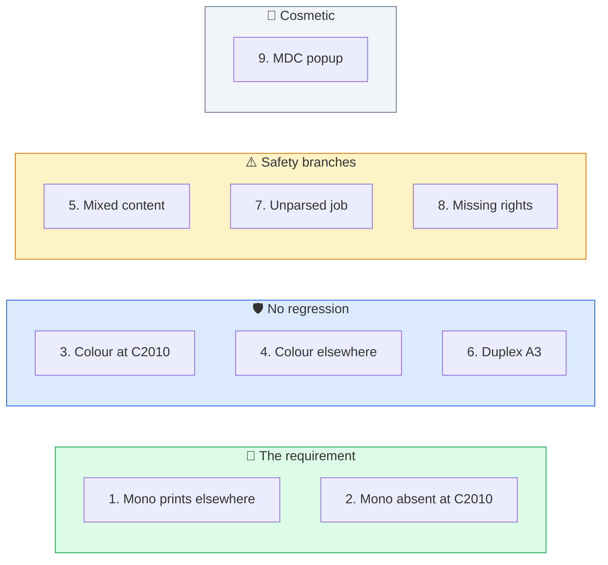

# 5️⃣ Phase 5, Enforce

One character changes. Then you prove it works.

---

## Step 5.1 🔛 Switch on

**Queues → secure → Job Processing → Scripting (PHP)**

Change `$ENFORCE = false` to `$ENFORCE = true`. Save.

No service restart. No downtime. Jobs already sitting in `secure` are unaffected until they are reprinted, because the script runs at processing time.

---

## Step 5.2 🧪 Test plan

Nine tests. Test 2 is the acceptance test, because it is the customer's actual requirement.

| # | Test | Expected result | Pass |
|---|---|---|:---:|
| 1 | Plain black Word document, release at IM 2500 | Prints normally | ☐ |
| 2 | 🎯 Same job, check the IM C2010 terminal | Job is **not** listed | ☐ |
| 3 | Document with a colour logo, release at IM C2010 | Prints normally | ☐ |
| 4 | Colour job at another colour device | Still available, unchanged | ☐ |
| 5 | Mixed document, mostly text with one colour page | Stays on `secure` | ☐ |
| 6 | Duplex A3 mono document | Moves and prints correctly | ☐ |
| 7 | Large PDF that fails to parse | Stays on `secure`, no loss | ☐ |
| 8 | User without `secure_mono` rights | Job stays put, error logged | ☐ |
| 9 | Desktop popup received | Only if MDC installed | ☐ |

### What each test is actually checking

Tests 5, 7 and 8 exist to prove that nothing gets lost when the rule cannot decide cleanly. If any of those three loses a job, stop and roll back.

### Test notes

| Test | How to produce the condition |
|---|---|
| 5 | A Word document with several text pages and one page containing a colour image. Confirm the log shows `Colour job` and `colour=1` or higher. |
| 7 | A malformed or heavily compressed PDF. If you cannot make one fail, temporarily set the Job Parser to Basic, print, then set it back. Expect the `No colour data` warning. |
| 8 | Remove a test user from the `secure_mono` rights list, print a mono job, confirm the `NO rights` error and that the job is still visible at other printers. Restore the rights afterwards. |

---

## ✅ Phase 5 exit criteria

| Check | State |
|---|:---:|
| `$ENFORCE = true` saved | ☐ |
| Test 2 passed, the mono job is not listed at the IM C2010 | ☐ |
| All nine tests recorded | ☐ |
| No test resulted in a lost job | ☐ |
| Test 8 rights restored | ☐ |

---

*Next: [Phase 6, close-out](08-phase-6-closeout.md)*
