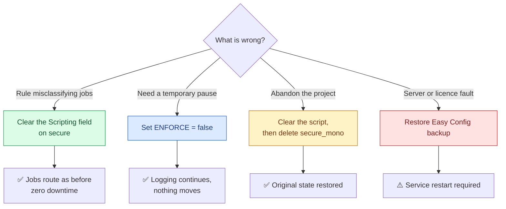

# ↩️ Rollback

Four scenarios. Three of them are zero downtime and take under a minute.

| Scenario | Action | Downtime |
|---|---|---|
| 🔴 Rule behaving wrongly | Clear the Scripting (PHP) field on `secure`, Save | **None** |
| 🟡 Pause without losing config | Set `$ENFORCE = false`, Save | **None** |
| 🔵 Full revert | Clear the script, delete `secure_mono` | **None** |
| ⚫ Server level problem | Restore the Easy Config backup from [Step 1.2](03-phase-1-server-preparation.md) | Service restart |

---

## Why it is this easy

`secure` is never modified during this deployment, so there is nothing to restore on the queue users depend on. No service restart is needed to clear or disable the script, and no queued jobs are lost.

---

## Choosing between clearing and pausing

| | Clear the field | `$ENFORCE = false` |
|---|---|---|
| Jobs move | No | No |
| Log lines written | No | Yes |
| Config preserved | No, you must paste it again | Yes |
| Best for | You want the rule gone | You want to keep watching without acting |

Pausing is almost always the better first move during an incident, because the log keeps telling you what the rule would have done while the pressure is off.

---

## What rollback does **not** need

| Not required | Reason |
|---|---|
| Touching any PC | Nothing was ever changed on a PC |
| Restarting MyQ services | Script changes take effect on save |
| Re-adding printers to `secure` | `secure` was never modified |
| Recovering lost jobs | Jobs are moved, never deleted |
| Re-unlocking scripting | Clearing the field needs the same unlock as editing, so if you re-locked in Phase 6, unlock first |

That last row is the one exception worth remembering. If scripting was re-locked in [Phase 6](08-phase-6-closeout.md), the fastest pause available to a first line engineer is deleting the `secure_mono` queue's printers, not editing the script. Plan for that in handover, or leave the customer a documented unlock procedure.

---

*Next: [Known limitations](10-limitations.md)*
