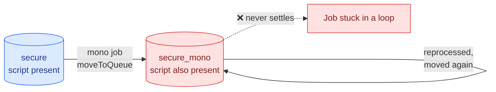

# ⚠️ Known Limitations

Brief the customer on **all** of these before deployment. Every one of them will otherwise arrive as a support ticket.

---

### 8.1 🎨 "B&W job" means no colour content, not "user chose B&W"

The parser judges by rendered content. A plain black text document sent with **Full Colour** selected in the driver has zero colour pages and will still be redirected.

This is the single most likely source of user questions. Put it in the announcement email if you send one.

---

### 8.2 👥 Mono jobs are unavailable at the IM C2010 for everyone

There is no per user exemption in this design.

If management need an override, they need a second queue containing the IM C2010 with restricted rights. Raise it before deployment, because adding it afterwards means a second script branch and another test cycle.

---

### 8.3 🔌 Device availability is not checked

The MyQ documentation exposes `isAnyPrinterAvailable()` on a queue object, but only in the context of looping a user's personal queues. There is no documented way to test whether a specific target printer is powered on before moving a job.

Because `secure_mono` contains the whole fleet minus one device, this is low risk here. It would matter if the target queue held only one printer.

---

### 8.4 🔔 Desktop notifications need MyQ Desktop Client

Without MDC, the move happens silently. Users will simply find the job at any other printer.

If MDC is not deployed and the customer wants users told, use [`../src/optional/email-notification.php`](../src/optional/email-notification.php) instead, which needs outgoing SMTP configured in MyQ.

---

### 8.5 📇 Copying is untouched

The script affects print jobs only. Walk up black and white copying on the IM C2010 still works.

MyQ has no "block mono copy" setting. That would need Ricoh side function restrictions on the device itself.

---

### 8.6 🚫 A job cannot be forced to colour

MyQ's colour property is read-only in this context. Redirecting is the correct design, not a workaround for something better.

---

### 8.7 ♾️ Never put this script on `secure_mono`

A moved job is reprocessed under the target queue's rules. The same script on both queues creates a loop.

Check this explicitly during close-out. It is easy to do by accident when copying a queue configuration.

---

## 📋 Briefing sheet

Hand this table to the customer and get it signed.

| # | Limitation | Customer accepts |
|---|---|:---:|
| 8.1 | Redirect is based on content, not the driver setting | ☐ |
| 8.2 | No per user exemption at the IM C2010 | ☐ |
| 8.3 | Printer power state is not checked | ☐ |
| 8.4 | Popups need MDC, email is the alternative | ☐ |
| 8.5 | Walk up mono copying is unaffected | ☐ |
| 8.6 | Jobs cannot be forced to colour | ☐ |
| 8.7 | Script must exist on one queue only | ☐ |

---

*Next: [Troubleshooting](11-troubleshooting.md)*
