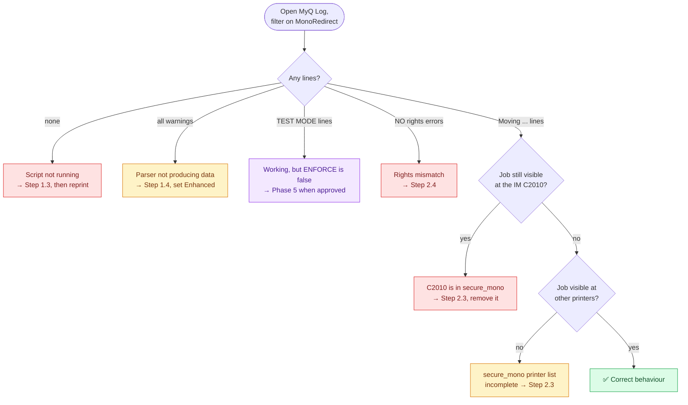

# 🔧 Troubleshooting

Symptom, likely cause, fix. Work top to bottom.

| 🔍 Symptom | Likely cause | Fix |
|---|---|---|
| Nothing at all in the Log | Script not saved, or scripting still locked | Re-check [Step 1.3](03-phase-1-server-preparation.md) |
| Every job logs "No colour data" | Job Parser off or set to Basic | [Step 1.4](03-phase-1-server-preparation.md), set Standard or Enhanced |
| Colour jobs being redirected | Parser misclassifying | Switch parser to Enhanced |
| Mono jobs not redirected | `$ENFORCE` still `false`, or wrong queue name | Check both values at the top of the script |
| "NO rights" errors in Log | Rights mismatch between queues | [Step 2.4](04-phase-2-mono-queue.md), copy rights from `secure` |
| Mono jobs still showing at the IM C2010 | IM C2010 accidentally added to `secure_mono` | [Step 2.3](04-phase-2-mono-queue.md), remove it |
| Mono jobs missing at other printers | Printer list on `secure_mono` incomplete | [Step 2.3](04-phase-2-mono-queue.md), mirror `secure` exactly, minus the C2010 |
| Redirected jobs vanish after a while | Retention shorter on `secure_mono` | [Step 2.5](04-phase-2-mono-queue.md), match retention |
| Job loops between queues | Script also pasted into `secure_mono` | Clear the script from `secure_mono`, see [8.7](10-limitations.md) |
| Users get no notification | MDC not installed | Expected, see [8.4](10-limitations.md) |
| Save button greyed out | Scripting re-locked in Easy Config | Re-enable Unlock PHP Scripting, restart services, log out and in |
| Script edits have no effect | Browser session cached before the unlock | Log out of the web interface and log back in |

---

## 🧭 Diagnostic order

When you do not know which of the above applies, follow the log.

---

## 🆘 When to roll back instead of debug

Stop debugging and go to [Rollback](09-rollback.md) if any of these are true:

| Condition | Why |
|---|---|
| A job has actually gone missing | The design says jobs are never deleted. If one is, something is wrong beyond configuration. |
| Jobs are looping between queues | Users cannot collect anything while this is happening. |
| Colour jobs are being redirected in volume | The customer's colour device is now unusable for its purpose. |
| You are inside a change window that is closing | Set `$ENFORCE = false` and finish the investigation out of hours. |

---

*Next: [End user notice template](12-user-notice-template.md)*
