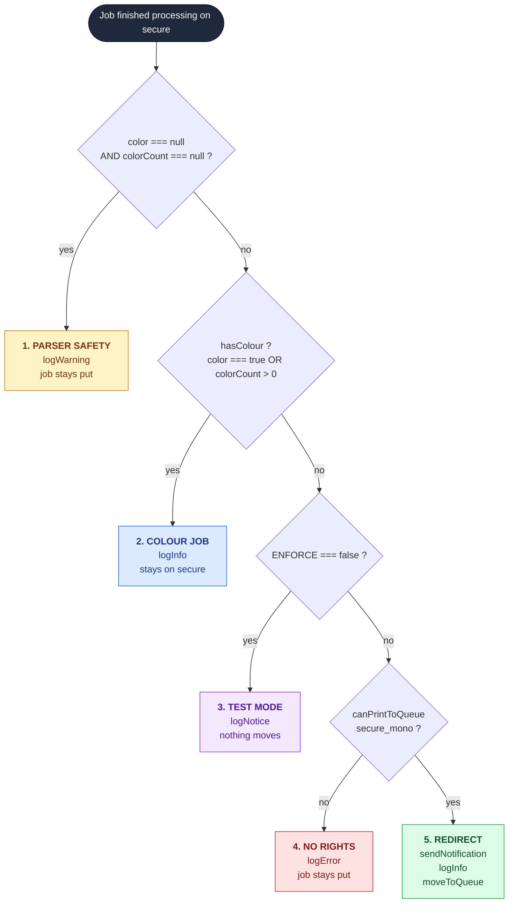

# 💻 Code Reference

The script that does the work. Everything in this folder is pasted into a MyQ text field, not installed on a server.

| File | Purpose | Required |
|---|---|:---:|
| [`mono-redirect.php`](mono-redirect.php) | The rule. Paste into the `secure` queue. | ✅ Yes |
| [`optional/email-notification.php`](optional/email-notification.php) | Email the user when a job moves. | ⬜ Optional |
| [`optional/rename-job.php`](optional/rename-job.php) | Prefix the job name with `[B&W]`. | ⬜ Optional |

---

## 📍 Where it goes

```
MyQ Web Interface
  └── Queues
        └── secure
              └── Job Processing tab
                    └── Scripting (PHP)
                          └── Actions after processing   ← paste here
```

The field is read-only until PHP scripting is unlocked in Easy Config. See [Phase 1](../docs/03-phase-1-server-preparation.md).

---

## ⚙️ Configuration

Two lines at the top of the file. Nothing else needs editing.

| Variable | Type | Default | Meaning |
|---|---|---|---|
| `$ENFORCE` | `bool` | `false` | `false` logs what would happen and moves nothing. `true` moves jobs. |
| `$MONO_QUEUE` | `string` | `"secure_mono"` | Target queue name. Case sensitive, must match exactly. |

`$ENFORCE` is the whole safety story. It lets you run the rule against real traffic for a week and collect numbers before anything changes for a single user.

---

## 🔌 MyQ API surface used

Verified against the official [MyQ X 10.2 PHP Scripts Actions Examples](https://docs.myq-solution.com/en/myq-x/10.2/print-server/php-scripts-actions-examples) and [Job Scripting Reference](https://docs.myq-solution.com/en/myq-x/10.2/print-server/job-scripting-reference). Call by call mapping in [../docs/13-references.md](../docs/13-references.md).

### Read from the job (`$this`)

| Property | Type | Notes |
|---|---|---|
| `$this->name` | `string` | Document name as sent by the driver. |
| `$this->queue->name` | `string` | Source queue. Used for logging only. |
| `$this->owner` | `User` | Object, not a string. |
| `$this->color` | `bool\|null` | `null` when the parser produced nothing. |
| `$this->colorCount` | `int\|null` | Colour page count. `null` when unparsed. |
| `$this->monoCount` | `int\|null` | Mono page count. |
| `$this->pageCount` | `int\|null` | Total pages. |

### Actions

| Call | Effect |
|---|---|
| `$this->moveToQueue($name)` | Relocates the job. Does not copy it. Must be the last statement. |
| `$this->name = "..."` | Renames the job as shown at the terminal. |
| `$owner->canPrintToQueue($name)` | Rights pre-check. Returns `false` when the user has no access. |
| `$owner->sendNotification($level, $title, $body)` | MyQ Desktop Client popup. Silent if MDC is absent. |
| `$owner->sendEmail($subject, $body)` | Needs outgoing SMTP configured. |
| `MyQ()->logInfo() / logNotice() / logWarning() / logError()` | Writes to the MyQ Log page. |

---

## 🧠 Control flow

Five branches, evaluated top to bottom. Exactly one runs per job.



Branch order is deliberate. Parser failure is checked first so a job with unknown content is never moved on a guess, and the rights check sits ahead of the move so a mismatch produces a log line instead of a stranded job.

---

## 📝 Log output

Every branch writes one line, all tagged `[MonoRedirect]`. Filter the MyQ Log page on that tag.

| Level | Branch | Example |
|---|---|---|
| 🟡 Warning | 1 | `No colour data from parser. Job 'Report.pdf' (jsmith) left on 'secure'.` |
| 🔵 Info | 2 | `Colour job 'Brochure.pdf' (jsmith) colour=4 mono=2 - stays on 'secure'.` |
| 🟣 Notice | 3 | `TEST MODE - 'Minutes.docx' (jsmith, 3 pages) would move to 'secure_mono'.` |
| 🔴 Error | 4 | `'jsmith' has NO rights to 'secure_mono'. Job left on 'secure'.` |
| 🟢 Info | 5 | `Moving 'Minutes.docx' (jsmith, 3 pages) from 'secure' to 'secure_mono'.` |

---

## ⛔ Three rules that must not be broken

| Rule | Reason |
|---|---|
| No `<?php` opening tag | MyQ supplies the PHP context. An opening tag breaks the field. |
| `moveToQueue()` stays last | The job is reprocessed under the target queue's rules from that call onward. Later statements are unreliable. |
| Never paste this on `secure_mono` | The moved job is reprocessed by the target queue, so the same rule on both queues creates a loop. |

---

## 🧩 Adapting it to another site

| Change | Edit |
|---|---|
| Different queue names | `$MONO_QUEUE`, and paste on your own source queue. |
| Reverse the rule (keep colour off a mono device) | Invert `$hasColour` in branch 2, and point the target at a colour-capable queue. |
| Threshold instead of any colour | Replace `$colorPgs > 0` with your own limit, for example `$colorPgs > 2`. |
| Restrict to one department | Wrap branch 5 in a check on `$owner` group membership. |

---

*Full deployment procedure: [`../docs/`](../docs/) &nbsp;·&nbsp; MyQ API references: [`../docs/13-references.md`](../docs/13-references.md)*
